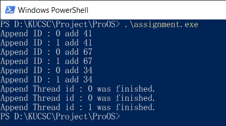
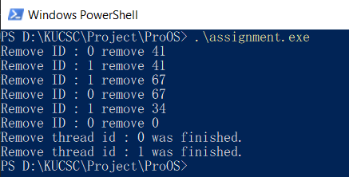
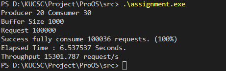

# งานกลุ่มวิชาระบบปฏิบัติการ ชั้นปีที่ 3 เทอมต้น ปีการศึกษา 2562
***
## การทดสอบรันโปรแกรม
คอมไพล์เลอร์ : Genaral C++ Complier (eg. [MinGW W64](https://sourceforge.net/projects/mingw-w64/)) 
ไลบราลี่ : [Boost C++ Libralies](https://www.boost.org/users/download/)
คอมไพล์ : ```g++ src/assignment.cpp -pthread -lpthread -o ```assignment
รันโปรแกรม : ```./assignment```
***
## การออกเเบบโปรเเกรม
***
### การออกเเบบ Buffer
```C
#include <boost/circular_buffer.hpp>
boost::circularbuffer<int> buffername(buffer size);
```
#### บัฟเฟอร์แบบวงกลม โดยใช้ Boost Libraly
บัฟเฟอร์แบบวงกลม (เรียกอีกอย่างว่าวงแหวนหรือบัฟเฟอร์แบบวงกลม) หมายถึงพื้นที่ในหน่วยความจำซึ่งใช้เพื่อเก็บข้อมูลที่เข้ามา เมื่อบัฟเฟอร์เต็มข้อมูลใหม่จะถูกเขียนเริ่มต้นที่จุดเริ่มต้นของบัฟเฟอร์และเขียนทับเก่า **boost :: circular_buffer** เป็นคอนเทนเนอร์ที่สอดคล้องกับ STL
มันเป็นชนิดของลำดับที่คล้ายกับ std :: list หรือ std :: deque สนับสนุนการเข้าถึงตัววนซ้ำแบบสุ่มแทรกเวลาอย่างต่อเนื่องและลบการดำเนินการที่จุดเริ่มต้นหรือจุดสิ้นสุดของบัฟเฟอร์และการทำงานร่วมกันกับอัลกอริทึม std
Circular_buffer ได้รับการออกแบบมาเป็นพิเศษเพื่อให้มีความจุคงที่ เมื่อความจุของมันหมดลงองค์ประกอบที่เพิ่งแทรกเข้าไปใหม่จะทำให้องค์ประกอบถูกเขียนทับทั้งที่จุดเริ่มต้นหรือจุดสิ้นสุดของบัฟเฟอร์ (ขึ้นอยู่กับการใช้งานการแทรก)
Circular_buffer จัดสรรหน่วยความจำเฉพาะเมื่อสร้างขึ้นเมื่อความจุถูกปรับอย่างชัดเจนหรือตามความจำเป็นเพื่อปรับขนาดหรือกำหนดการดำเนินการ  
  
นอกจากนี้ยังมีรุ่น Circular_buffer_space_optimized  

### การออกเเบบ Append
append_ ฟังก์ชัน รูปร่างหน้าตาของ append_
```c
void append_(int id)
{
    ++num_append_working;
    while (i < REQUEST)
    {
        add_item(id);
        ++i;
    }
    this_thread::sleep_for(chrono::nanoseconds(wait_time));
    --num_append_working;
}

```
ฟังก์ชัน append จะเพิ่มค่าของ num_append_work แล้วทำการเพิ่มค่าลงไปในบัฟเฟอร์คิว ตามจำนวนของการ รีเควส โดยการให้เทรดที่เรียกใช้งาน append ทำงานในฟังก์ชัน add_item และเมื่อทำงานเสร็จสิ้นจะหยุดการทำงานของเทรดที่เรียก append และ ลดค่าของ num_append_working ลง
#### ฟังก์ชั่น add_item
add_item ฟังก์ชัน ที่ถูกเรียกใช้งานโดย เทรดต่าง ๆ ของ append_ เพื่อนำค่าเข้าไปในคิว
```C
void add_item(int append_id)
{
    int random_num = rand() % 100;
    unique_lock<mutex> lock(ymutex);
    is_not_full.wait(lock, [] { return myringbuf.size() != BUFFER_SIZE; });
    myringbuf.push_back(random_num);
    // cout << "Append ID : " << append_id << " add " << random_num << endl;
    is_not_empty.notify_all();
}
```
add_item() ออกแบบให้สามารถเข้าใช้งานได้เพียงเทรดเดียวเท่านั้นโดยค่าที่ จะถูกส่งเข้ามาเป็นค่า thread id ของ append thread จากนั้นจะใช้ mutex ล็อกทรัพยากรบัฟเฟอร์ให้เทรดนั้น ๆ เพื่อไม่ให้เทรดอื่น ๆ ที่รอคอยอยู่เข้ามาทำงานได้ แล้วจะมีการทำงานอยู่ 2 แบบดังนี้
* บัฟเฟอร์เต็ม ก็จะทำการหยุดการทำงานเทรดนั้นชั่วขณะ และส่งสัญญาณว่าคิวไม่ว่างออกไป
* บัฟเฟอร์ไม่เต็ม ก็จะทำการเรียกดูขนาดของคิวมาเก็บไว้ในตัวแปร และ เขียนค่าตัวแปรนั้นลง ไปในคิว และเมื่อทำงานเสร็จก็จะส่งสัญญาณออกไปว่าคิวไม่ว่างแล้ว

***
### การออกเเบบ Remove
remove_ ฟังก์ชัน หน้าตาของ remove
```c
void remove_(int id)
{
    while (num_append_working == 0)
    {
        this_thread::yield();
    }
    while (num_append_working != 0 || myringbuf.size() > 0)
    {
        remove_item(id);
        this_thread::sleep_for(chrono::nanoseconds(wait_time));
    }
}
```
ฟังก์ชัน remove จะตรวจสอบว่าไม่มีเทรด append ทำงานอยู่หรือบัฟเฟอร์ไม่ว่างก็จะเรียกการทำงานของ remove_item เพื่อนำคิวออกจากบัฟเฟอร์จากนั้นก็จะหยุดการทำงานของเทรดนั้นลง

#### ฟังก์ชั่น remove_item
remove_items ฟังก์ชันที่ถูกเรียกใช้งานโดย เทรดต่าง ๆ ของ remove_ เพื่อนำค่าออกจากคิว
```c
void remove_item(int remove_id)
{
    unique_lock<mutex> lock(ymutex);
    int product;
    if (is_not_empty.wait_for(lock, chrono::nanoseconds(wait_time),
                              [] { return myringbuf.size() > 0; }))
    {
        product = myringbuf.front();
        myringbuf.pop_front();
        ++c_count;
        // cout << "Remove ID : " << remove_id << " remove " << product << endl;
        is_not_full.notify_all();
    }
}
```
ฟังก์ชัน remove_item จะมีการเข้าถึงฟังก์ชันนี้ได้เพียงแค่เทรดเดียวเท่านั้น เมื่อทำการเรียกใช้งานฟังก์ชั่นก็จะใช้ mutex ล็อกทรัพยาการบัฟเฟอร์ให้เข้าถึงได้เพียงแค่เทรดเดียวและมีการทำงานอยู่ 2 แบบดังนี้
* บัฟเฟอร์ว่าง จะหยุดการทำงานเทรดนั้น ๆ และส่งสัญญาณออกไปให้เทรดอื่น ๆ ที่รอทำงาน
* บัฟเฟอร์ไม่ว่างหรือเต็ม จะไอเท็มที่ฟน้าคิวและทำการ dequeue ออกจากบัฟเฟอร์ และส่งสัญญาณให้เทรดอื่น ๆ ที่รอทำงาน
### Flowchart ของโปรแกรม

***
## เงื่อนไข วิธีการทำงาน เเละการพิสูจน์คุณสมบัติของ Append
### ฟังก์ชั่น Append
```c
void append_(int id)
{
    ++num_append_working;
    while (i < REQUEST)
    {
        add_item(id);
        ++i;
    }
    this_thread::sleep_for(chrono::nanoseconds(wait_time));
    --num_append_working;
}
```
#### เงื่อนไขของ Append
เงื่อนไขการทำงานของ append  
1. ทำงานตามรีเควสที่กำหนด
2. เข้าถึงบัฟเฟอร์ได้เพียงเทรดเดียว
3. ทุกเทรดมีเวลาทำงานจำกัดในการทำงาน
#### วิธีการทำงานของ Append
1. เพิ่มค่าของ num_append_working ขึ้นตามจำนวนเทรดที่ใช้งาน
2. วนลูปทำงานตามรีเควสที่ได้กำหนดไว้
3. เรียกใช้งาน add_item โดยส่งค่า Append_id ไปให้
    * รับค่าของ append id 
    * สุ่มตัวเลขและเก็บไว้ในตัวแปร
    * ล็อก metex ให้เทรดที่เรียกใช้งาน
    * ตรวจสอบบัฟเฟอร์
        ```
        is_not_full.wait(lock, [] { return myringbuf.size() != BUFFER_SIZE; });
        ``` 
        เมื่อบัฟเฟอร์ไม่เต็มก็จะไม่ถูกเรียกใช้คำสั่ง wait() แต่หากบัฟเฟอร์เต็มเทรดนั้น ๆ ก็จะถูกเปลี่ยนสถานะให้รอจนกว่าจะได้รับสัญญาณ
    * เพิ่มค่าของ random_num เข้าไปที่ท้ายคิวของบัฟเฟอร์
    * แสดงผลการเพิ่ม
    * ส่งสัญญาณให้ทุกเทรดที่รอการทำงานว่าบัฟเฟอร์ไม่ว่าง
3. เพิ่มค่า i
4. เมื่อเทรดใดเทรดหนึ่งทำงานถึงระยะเวลาที่ได้กำหนดไว้ใน wait_time ก็จะหยุดการทำงานของเทรดลงไป
5. ลดค่าของ num_append_working ลงตามจำนวนเทรดที่ปิดใช้งานไป
        
#### การพิสูจน์คุณสมบัติของ Append
***
ผลการทดสอบคุณสมบัติของ append  


## เงื่อนไข เเละวิธีการทำงานของ Remove
ฟังก์ชัน remove
```C
void remove_(int id)
{
    while (num_append_working == 0)
    {
        this_thread::yield();
    }
    while (num_append_working != 0 || myringbuf.size() > 0)
    {
        remove_item(id);
        this_thread::sleep_for(chrono::nanoseconds(wait_time));
    }
    cout << "Remove thread id : " << id << " was finished.\n" << endl;
}
```
#### เงื่อนไขของ Remove
1. ตรวจสอบการทำงานของ append ว่าไม่มีการทำงานอยู่
2. ตรวจสอบบัฟเฟอร์ว่าไม่ได้ว่างอยู่
3. เข้าถึงบัฟเฟอร์ได้เพียงเทรดเดียว
4. ทุกเทรดที่ทำงานมีเวลาจำกัดในการทำงาน

#### วิธีการทำงานของ Remove
***
1. ตรวสอบว่าเทรดของ append ไม่ได้มีการทำงานอยู่ โดยตรวจสอบจากตัวแปร num_append_working
2. หากไม่มีเทรดใดของ append ทำงานอยู่แล้ว ให้ทำการรอชั่วขณะ
3. หากบัฟเฟอร์มีขนาดมากกว่า 0 ให้ทำการเรียกใช้งาน remove_item พร้อมส่งค่า id ของเทรดไปด้วย
    * รับค่า thread id
    * ล็อกการทำงานของ mutex ให้เทรดที่เรียกใช้งาน
    * ตรวจสอบว่าบัฟเฟอร์ไม่ว่าง
    ```C
    if (is_not_empty.wait_for(lock, chrono::nanoseconds(wait_time),
                              [] { return myringbuf.size() > 0; }) 
    ```
    * เลือกตำแหน่งต้นคิว และ ลบออกจากคิว
    * เพิ่มค่า c_count
    * แสดงผลการทำงาน
    * ส่งสัญญาณว่าบัฟเฟอร์ไม่เต็มออกไปให้ทุกเทรดที่รอการทำงาน
4. หากเทรดทำงานจนถึงเวลาที่กำหนดให้หยุดการทำงานของเทรดนั้น ๆ 
5. แสดงผลการทำงาน

#### การพิสูจน์คุณสมบัติของ remove
ผลการทดสอบคุณสมบัติของ remove  

## ผลการ Run & Result
***

## Source code 
***
thsis git repo
